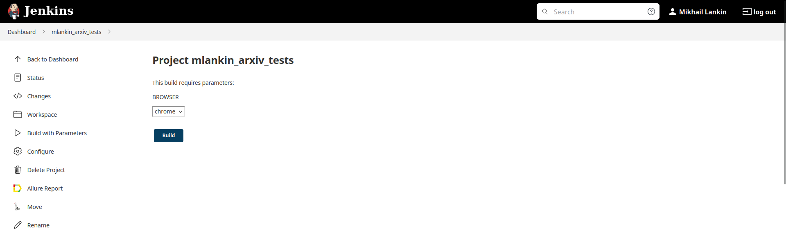
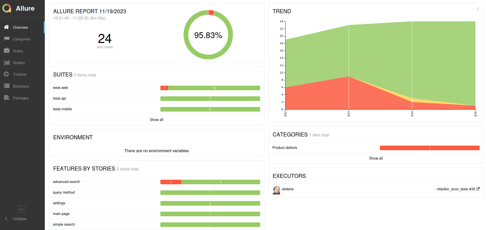
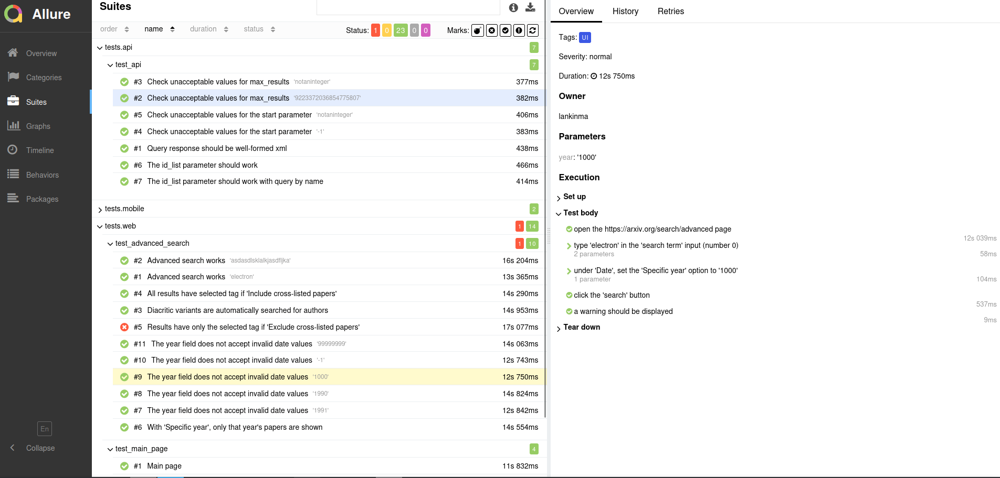
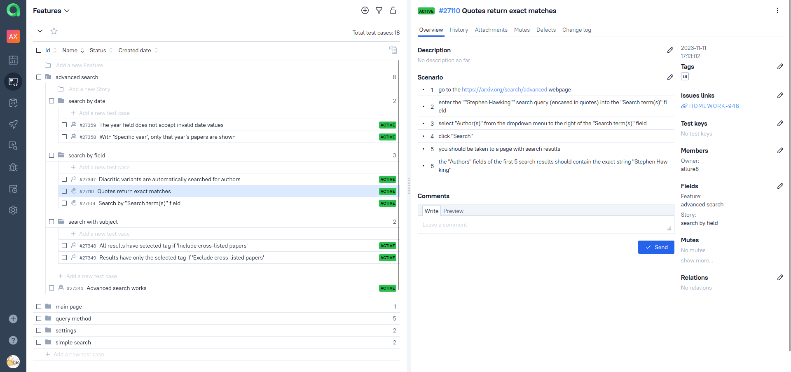
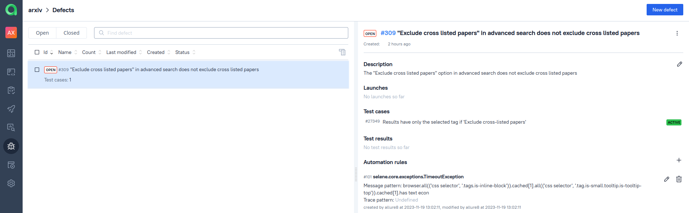
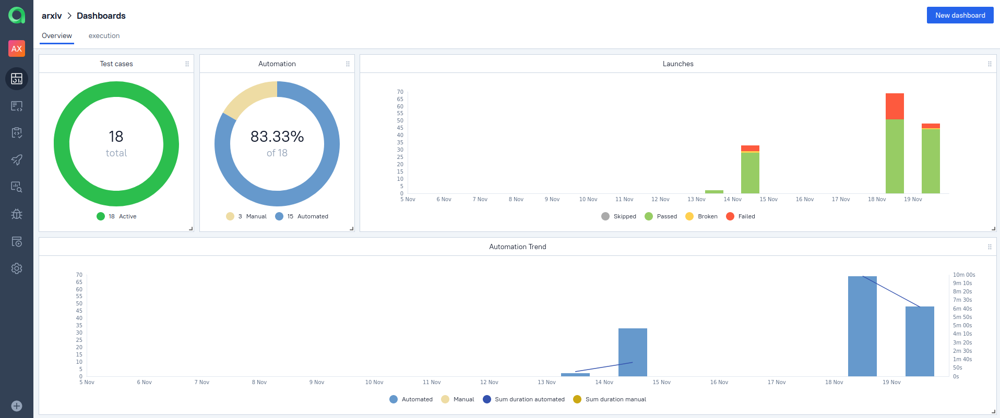
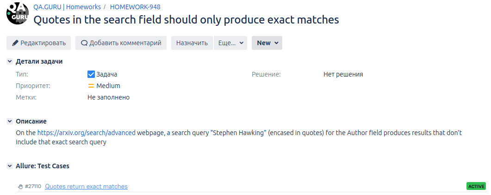

# A SAMPLE TEST BASE FOR THE [ARXIV](https://arxiv.org/) WEB-SITE

ArXiv is a website that has been allowing free access to scientific articles in certain fields since the beginning of 1990s. 


In a nutshell:


## Covered functionality:

- Simple search
- Advanced search (https://arxiv.org/search/advanced) by field, tag, and date
- The 'query' API method, which returns an Atom feed

Two bugs have been discovered, and Jira tickets have been created for both of them ([this](https://jira.autotests.cloud/browse/HOMEWORK-963) and [this](https://jira.autotests.cloud/browse/HOMEWORK-948)).

The project has both manual and automated tests, the former are stored in an Allure Testops project.

A [separate project](https://github.com/rattus-aristarchus/test-arxiv-mobile) hosts tests for the arXiv android app.

## Tech stack:


## Local execution

To run the tests locally, do the following:

- clone the remote repository `https://github.com/rattus-aristarchus/test_arxiv.git`
- create an `.env` file with environment variables. The file should contain the following variables:
```
SELENOID_LOGIN="your login for the selenoid server"
SELENOID_PASSWORD="your password for the selenoid server"
```
- execute the following commands in the root folder of the project:
```sh
python -m venv .venv
source .venv/bin/activate
pip install poetry
poetry update
pytest tests
```


##  Remote execution

There is a [Selenoid](https://selenoid.autotests.cloud/#/) server with a [Jenkins](https://jenkins.autotests.cloud/job/mlankin_arxiv_tests/) project that can execute tests stored in this repository. To run the tests:
- open the project
- click "Build with Parameters"
- choose the build parameters (or just use default values)
- click "Build"



### Allure Report

The Jenkins project is integrated with Allure Report. Once the job has run, it creates a link to the report:



The "Suites" tab has a detailed representation of how each test was executed, with steps, attachments, etc.




### Allure Testops

The Jenkins project is also integrated with an [Allure Testops project](https://allure.autotests.cloud/project/3759/dashboards), which stores test results for all previous launches of the project. Why would we need that? 

-  to have manual and automated test cases in the same interface, showing their collective coverage of features:



- to have defects that help categorize and quickly sort test failures:



- to have aggregated statistics on test runs:



### Jira

The Allure Testops project is integrated with Jira. Separate issues have been created for each detected bug (see [here](https://jira.autotests.cloud/browse/HOMEWORK-948) and [here](https://jira.autotests.cloud/browse/HOMEWORK-963)). Each issue is linked to an Allure Testops test case, and vice versa.


