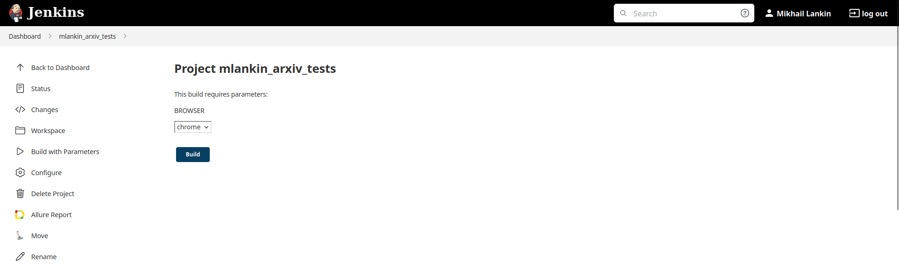
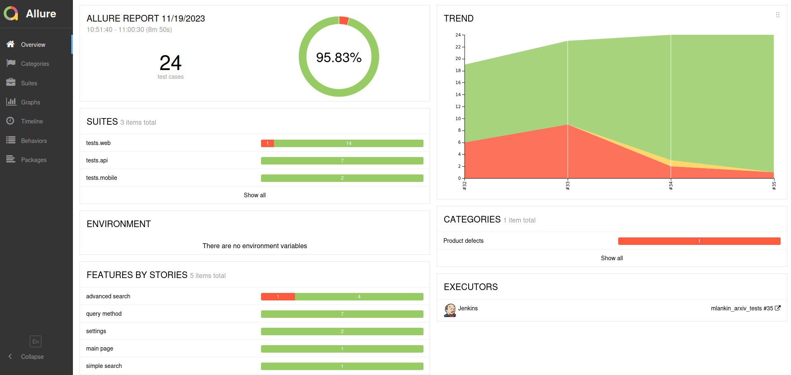
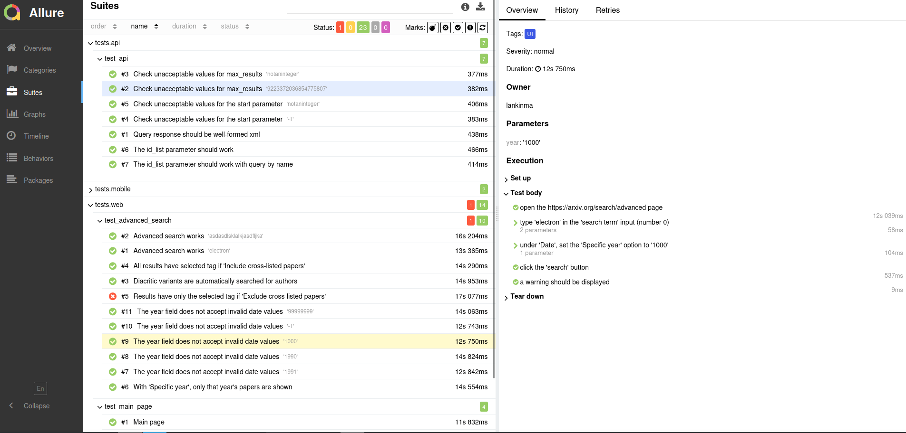
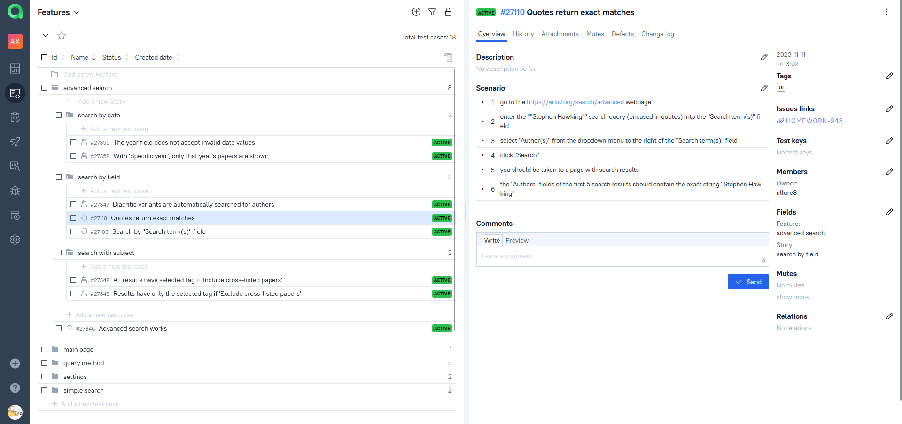
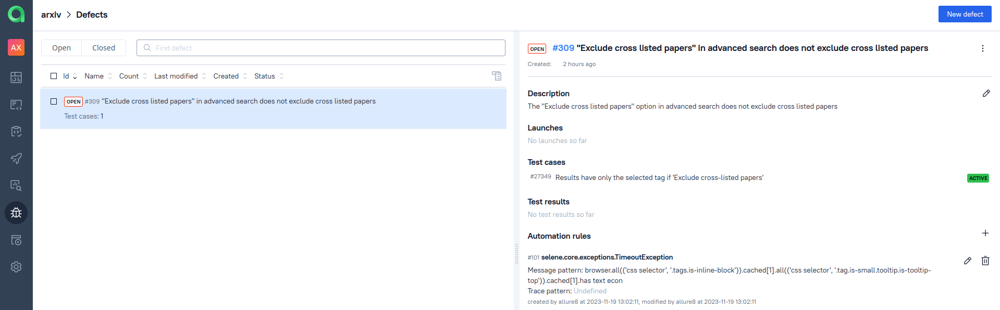
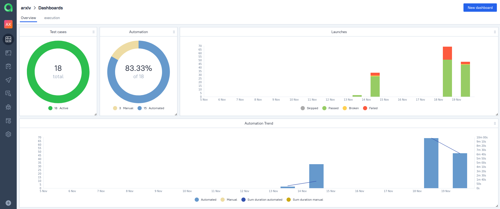

# ПРИМЕР ПРОЕКТА ПО ТЕСТИРОВАНИЮ UI И API САЙТА [ARXIV](https://arxiv.org/)

ArXiv - сайт, на котором с начала 1990х годов выкладывают в открытом доступе статьи по естественным наукам.


В двух словах:


## Покрытый функционал:

- Простой поиск на сайте
- Расширенный поиск (https://arxiv.org/search/advanced) по отдельным полям, темам и датам
- Метод query в API-запросах, возвращающий Atom-фид

Обнаружено несколько неисправностей, по которым заведены тикеты в Jira ([раз](https://jira.autotests.cloud/browse/HOMEWORK-963) и [два](https://jira.autotests.cloud/browse/HOMEWORK-948)). 

В проекте использованы как автоматизированные, так и ручные тесты (тест-кейсы для них хранятся в Allure Testops).

В [отдельном проекте](https://github.com/rattus-aristarchus/test-arxiv-mobile) находятся тесты для мобильного приложения arXiv mobile.

## Стек технологий:


## Локальный запуск

Для запуска тестов на своей машине необходимо:

- клонировать репозиторий `https://github.com/rattus-aristarchus/test_arxiv.git`
- создать файл `.env` с переменными среды. Файл должен содержать следующие переменные:
```
BROWSERSTACK_LOGIN=логин для browserstack (для запуска мобильных тестов)
BROWSERSTACK_PASSWORD=пароль для browserstack
```
- выполнить следующие команды в корневой папке проекта:
```sh
python -m venv .venv
source .venv/bin/activate
pip install poetry
poetry update
pytest tests
```


## Удаленный запуск

На сервере [Selenoid](https://selenoid.autotests.cloud/#/) написан проект в [Jenkins](https://jenkins.autotests.cloud/job/mlankin_arxiv_tests/), выполняющий тесты из этого репозитория. Чтобы запустить в нём тесты, необходимо:
- открыть проект
- нажать "Build with Parameters"
- выбрать параметры для запуска (или оставить значения по умолчанию)
- нажать "Build"



### Отчеты в Allure Report

Проект Jenkins интегрирован с Allure Report. После выполнения джобы можно сразу перейти к отчёту по ней:



Подробное отображение выполнения каждого теста можно найти в разделе "Suites":




### Отчеты в Allure Testops

Проект Jenkins так же интегрирован с [проектом Allure Testops](https://allure.autotests.cloud/project/3759/dashboards), который хранит результаты всех прошлых запусков. Зачем? Чтобы иметь:

- отображение ручных и автоматизированных тест-кейсов в одном интерфейсе, с представлением их общего покрытия функциональности:



- дефекты, помогающие быстро сортировать ошибки в тестах:



- общую статистику выполнения:



### Jira

Проект в Allure Testops интегрирован с Jira, в ней заведены задачи по обнаруженным неисправностям ([вот](https://jira.autotests.cloud/browse/HOMEWORK-948) и [вот](https://jira.autotests.cloud/browse/HOMEWORK-963)). В задачах есть ссылки на соответствующие тесты в Testops, и наоборот.


